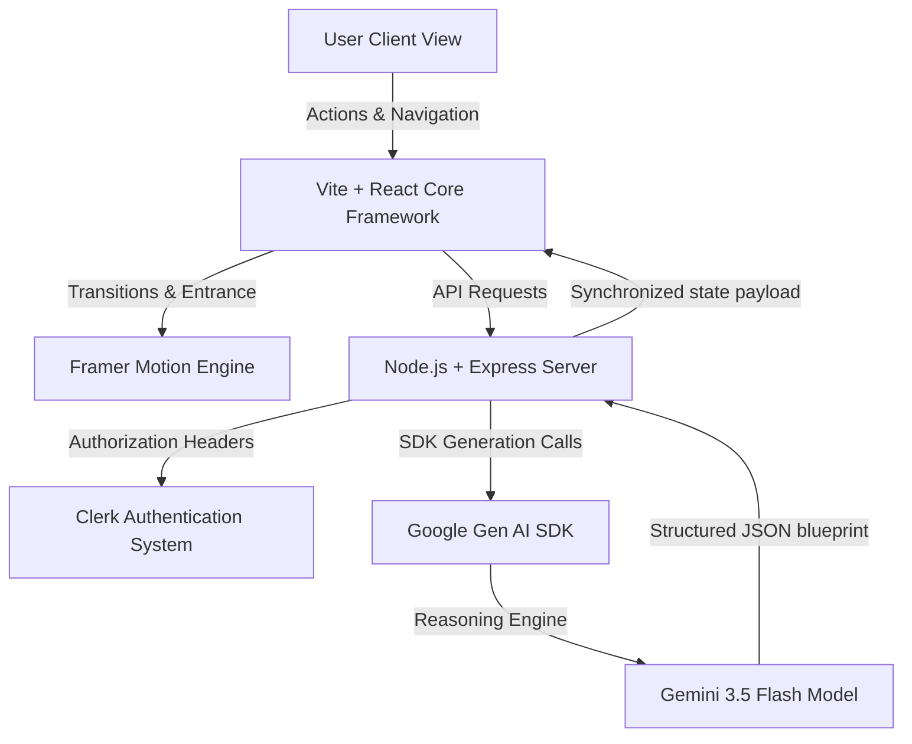

# 🚀 BuildMind AI — Premium Developer Tooling Suite

Welcome to **BuildMind AI**, a state-of-the-art full-stack AI development companion powered by the **Gemini 3.5 Flash** model. This platform compiles responsive frontend views, optimizes algorithms, evaluates time/space computational complexities, designs REST API specifications, and maps learning paths — all inside a cohesive, glassmorphic UI container.

> [!TIP]
> **New Feature:** Added coordinated, physics-based staggered entrance transitions across all tabs utilizing `framer-motion` for a liquid-smooth feel on startup.

---

## 🛠️ Integrated AI Development Tools Suite

| Module | Purpose | Accent Color / Theme |
| :--- | :--- | :--- |
| **🎨 AI Frontend Developer** | Draft mock layouts, live preview responsive elements, and extract Tailwind CSS codes. | Pink ➔ Red |
| **💻 AI Code Generator** | Generate production-ready code in JS, TS, Python, Go, Rust, and C++ with clean architecture. | Purple ➔ Pink |
| **🗺️ Learning Roadmaps** | Design custom career pathways and tech stack syllabi with estimated durations. | Cyan ➔ Blue |
| **📊 Complexity Auditor** | Calculate worst-case Big-O metrics, analyze bottlenecks, and graph curves on an SVG chart. | Emerald ➔ Teal |
| **🧮 Algorithm Tracer** | Trace stack states, variable registers, and execution logic loops step-by-step. | Orange ➔ Red |
| **🔌 API Mock Generator** | Design REST backend routing files, test payloads, and client async fetch templates. | Indigo ➔ Purple |
| **💬 Gemini Companion** | Real-time chat assistance linked to secure Clerk authentication sync databases. | Blue ➔ Cyan |

---

## 🏗️ Architecture & Interaction Flow



---

## ⚡ Local Setup and Deployment

### Prerequisites
* **Node.js** (v18.0 or newer recommended)
* A valid **Gemini API Key** from Google AI Studio

### 1. Clone & Install Dependencies
Navigate to your workspace directory and download the packages:
```bash
npm install
```

### 2. Configure Environment Variables
Create a `.env.local` file in the root directory (based on `.env.example` template):
```env
# Required for Gemini AI Studio reasoning models
GEMINI_API_KEY="YOUR_ACTUAL_GEMINI_API_KEY"

# Self-referential URL where client assets are located
APP_URL="http://localhost:3000"

# Clerk Publishable Key (Provided by default for session authorization)
VITE_CLERK_PUBLISHABLE_KEY="pk_test_ZHJpdmluZy1uYXJ3aGFsLTMyLmNsZXJrLmFjY291bnRzLmRldiQ"
```

### 3. Launch Development Server
Boot up the full-stack server running Express middleware & Vite HMR:
```bash
npm run dev
```
Open your browser and navigate to **[http://localhost:3000](http://localhost:3000)**.

---

## ✨ Features Added

> [!NOTE]
> We converted all static tab layout containers to `<motion.div>` animations, creating a unified premium user experience:
> 1. **Coordinated Waterfall Stagger:** Elements fade in and slide up sequentially (Header ➔ Configuration Forms ➔ Results Canvas).
> 2. **Physics-based Spring Motion:** Transition uses a natural spring physics coefficient (`stiffness: 120, damping: 18`) to make the pages feel alive and highly responsive to inputs.
> 3. **Clean Code & Type Safety:** Verified and compiled clean with zero warnings or errors.
